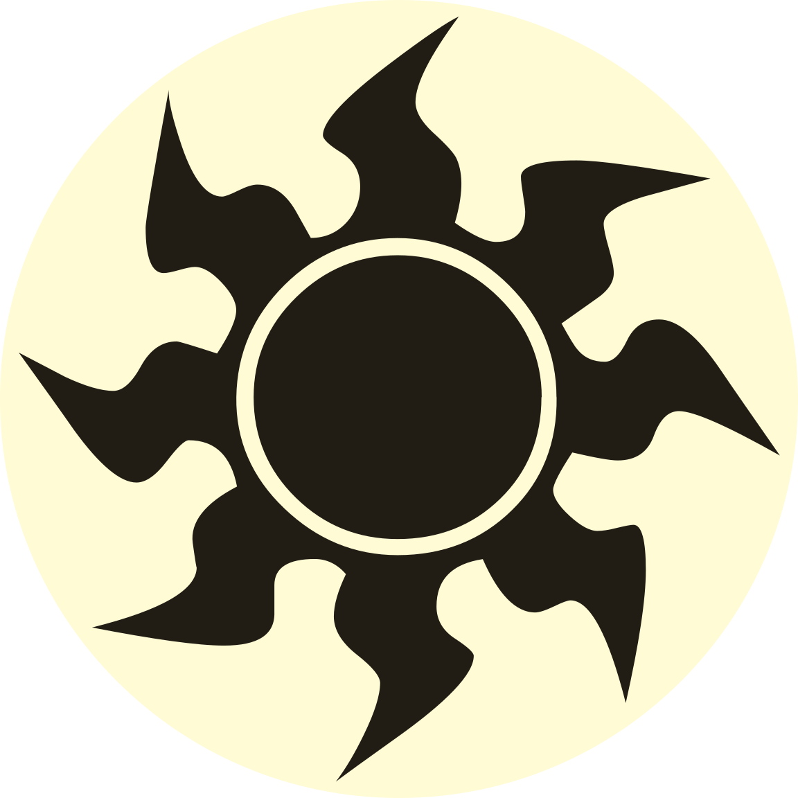

<!-- This page is automatically generated by Myr: do not update it manually. Changes directly applied here will be lost. -->
# Azorius Caw Blade
 
**Aliases**: 

**Dominant mana**:  

**Type**: `Midrange`

**Description**: TODO.

## **Staples**

  
Click here to expand

 

## **Frequent cards**

  
Click here to expand

 

## **All decks**

| Name | Set name | Set date | Legal |
| -----| -------- | -------- | ----- |
| [Azorius Caw Blade 529.001.eternalgathering](https://www.mtggoldfish.com/deck/4351088) | Rivals of Ixalan | 2018-01-19 | ✅ |
| [Azorius Caw Blade 493.001.gabripo93](https://www.mtggoldfish.com/deck/4351089) | Amonkhet | 2017-04-28 | ✅ |

## **Resources**

| 🗣️ | Name | Author | Date |
| -- | ---- | ------ | ---- |
| 🇮🇹 | [UW Caw Blade – un midrange atipico](https://eternalgathering.altervista.org/caw-blade/) | eternalgathering | 2018-02-23   |

