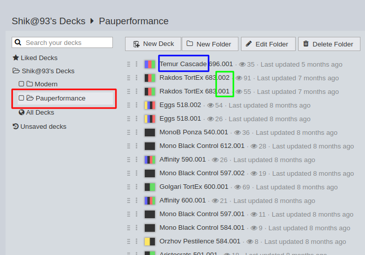
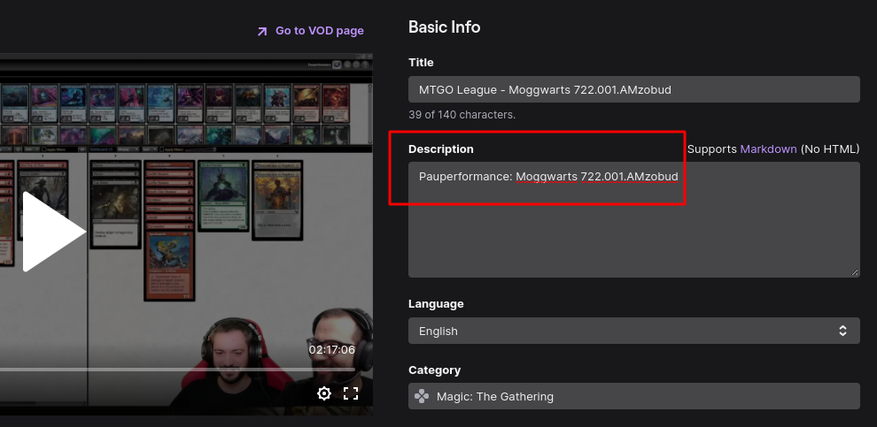

# PhD Guidelines

A creator that joins the Pauperformance network and contributes to the Academy with original content is referred as **PhD** (**Pauper honourable Dignitary**).

This page defines the guidelines to become a PhD and add content to the Academy.

---
Table of Contents

* [How to become a PhD](#how-to-become-a-phd)
* [How to publish a deck](#how-to-publish-a-deck)
* [How to publish a Twitch video](#how-to-publish-a-twitch-video)
* [How to publish a YouTube video](#how-to-publish-a-youtube-video)
* [How to publish a sideboard guide](#how-to-publish-a-sideboard-guide)

---
### How to become a PhD

Becoming a PhD of Pauperformance is easy, unlike in real life.

If you have a Twitch/YouTube channel with at least 100 followers you can join the network today.

Please, carefully compile [this form](https://docs.google.com/forms/d/e/1FAIpQLSckssNTDcknlPyi06OojWfzcbK2Ja7WNRSxegwIz1OiTIxPuA/viewform), and you will be contacted by a Pauperformance admin.
We will verify your identity, create a dedicated page for you in the website, and authorize you to publish to the Academy.

Optionally, join [our Discord](https://discord.gg/fYQbpjjkQ3), so it will be easy for us to share PhD-related updates with you.

---
### How to publish a deck

If you are a PhD, you can publish your decks to the Academy.

The current procedure to publish decks is not as straightforward as we would like it to be.
We plan to improve this aspect in the future.
Please, be patient: it is in our roadmap.
In any case, it's not cumbersome, as you will see.

For a number of technical reasons, [deckstats.net](https://deckstats.net/) is currently the easiest platform for [Myr](https://pauperformance.com/pages/faq.html#who-is-myr) to automatically retrieve decks from PhDs.

Once a deck is retrieved, it will be processed, re-uploaded to MTGGoldfish, and published to the Academy.
PhDs will be notified when the procedure is completed.

First, if you haven't done it yet, create a **folder** in your deckstats account named `Pauperformance` (case-sensitive).

A visual example for the PhD [Shik@93](https://deckstats.net/decks/78813/f88838/) is provided with the screenshot below:


The `Pauperformance` folder is highlighted in red.
[Myr](https://pauperformance.com/pages/faq.html#who-is-myr) will only search in this **folder** for new Academy decks to retrieve.
Please, keep out of this folder decks you don't want to publish to the Academy.

Finally, create a new deck in this folder with a valid `PAUPERFORMANCE_DECK_NAME`.

**TIP**: after having specified your new deck name, you can save a lot of time by importing the card list from a list or a file.
Supported formats are .cod (Cockatrice), .csv (Deckbox), .dck (XMage), .dec (Apprentice), .dek (MTGO Magic Online), .mwDeck (MWS), .o8d (OCTGN).
We are lazy and we like this shortcut a lot to create a deck in less than a minute.

That's it.
The deck will automatically appear in the Academy!

For this project, naming is essential.
Please, pay attention to the following notes: it is easy to specify an invalid `PAUPERFORMANCE_DECK_NAME` the first times you try.

Let's quickly recap the parts you need for a valid deck name.

The `PAUPERFORMANCE_DECK_NAME` is the unique identifier of the deck in the Academy.
It is canonically formatted as `Archetype_name magic_set_id.revision_id.player_id`.

The initial part is the `Archetype_name`.
In the example, it's `Temur Cascade`, highlighted in blue.
It has to be one of those listed in the [Archetypes Index](./archetypes_index.md).
If the archetype is missing, please contact us: we will be happy to create a new archetype for you in the Academy, if that makes sense.
We are thrilled by the idea you are creating a new archetype and evolving the format!

Then, there is the `magic_set_id`.
In the example, it's `696` (immediately after `Temur Cascade`, highlighted in blue).
You can get the **current** Pauperformance code from the home page.
At the time of writing, March 2022, it is `722` (associated to Kamigawa: Neon Dynasty).
However, if you are interested in creating a deck for a past meta, you can get the **old** Pauperformance code from the [Set Index](./set_index.md) (the set number should be in **bold**).
This is generally useful if you are uploading decks for your old Twitch/YouTube videos (and you are our hero!).
So, for example, if you want to submit a Burn deck created after the release of Modern Horizons, you will use the code `587	`.

The final part of the name is the `revision_id`.
It is common for players to try different iterations/versions of the same deck.
You can name them with an increasing number: `001`, `002`, `003`, etc.
In the example, they are highlighted in green.

The final part is the `player_id`.
However, since **you** are uploading the deck, it is **not** necessary to specify the `player_id`.
[Myr](https://pauperformance.com/pages/faq.html#who-is-myr) will automatically link this deck to you.
In fact, in the example above, you can see a deck is named `Temur Cascade 696.001` (and **not** `Temur Cascade 696.001.Shik@93`).
This is because `Shik@93` is implicit.

Please note once a deck is imported in the Academy, it cannot be modified or deleted by a PhD (only Pauperformance admins can).
Any change applied to the deck in deckstats will not be reflected in the Academy.
If you want to make a change, please create a new revision (`002`, `003`, ...).
Please, accept this "read-only feature" for the time being.

Finally, keep in mind any comment you write for your deck in deckstats will be preserved by Myr (it will appear in MTGGoldfish).

We trust our PhDs to publish content meaningfully and responsibly.
Thanks a lot!

---
### How to publish a Twitch video

If you are a PhD, linking a Twitch video to an Academy deck is straightforward.

Please note you **don't** need to be the owner of the deck you are trying to link your video to.
This is because it's common for a player to try other players' decks.

First, make sure the deck is published in the Academy.
If the deck is not in the Academy yet, please read above [how to publish a deck](#how-to-publish-a-deck).

Finally, write a line in the **description** of your video formatted as:

```Pauperformance: PAUPERFORMANCE_DECK_NAME```

The `PAUPERFORMANCE_DECK_NAME` is the unique identifier of the deck in the Academy.
It is canonically formatted as `Archetype_name magic_set_id.revision_id.player_id`.

That's it.
The video will automatically appear in the Academy!

For example, if you want to link a video to the deck `Moggwarts 722.001.AMzobud`, your description will contain:

```Pauperformance: Moggwarts 722.001.AMzobud```

A visual example is provided with the screenshot below:


Please note the line in the description is **case-sensitive**: make sure to correctly use capital letters.

It is **not** required to have the line in the beginning of the description.
You can place it wherever you want.
In fact, a common choice is to place this line as the final line of the description.

We trust our PhDs to publish content meaningfully and responsibly.
Thanks a lot!

---
### How to publish a YouTube video

At the moment, [Myr](https://pauperformance.com/pages/faq.html#who-is-myr) cannot automatically collect YouTube video from PhDs and link them to the Academy.

This is a top priority for us. We are working hard to implement this feature, and you can expect it to become available in the upcoming weeks.

However, we can anticipate you we are planning to use the same mechanism already in place for Twitch.
So, you can already start annotating your YouTube videos as you would do for Twitch.
As soon as YouTube crawling will be supported, all your videos will immediately become available in the Academy.

---
### How to publish a sideboard guide

At the moment, [Myr](https://pauperformance.com/pages/faq.html#who-is-myr) cannot automatically collect sideboard guides from PhDs and link them to the Academy.

This is a top priority for us. We are working hard to implement this feature, and you can expect it to become available in the upcoming weeks.
